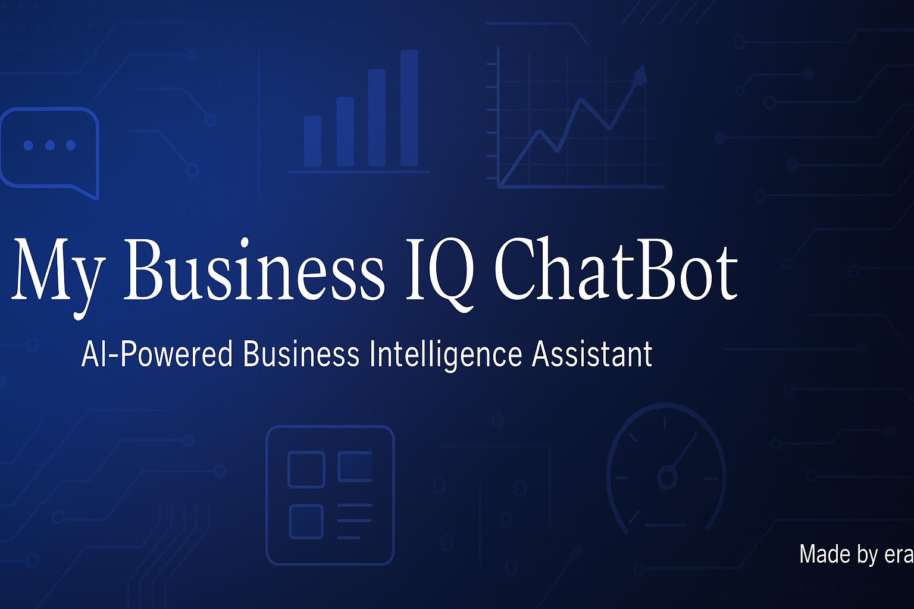

<div align="center">

# My Business IQ ChatBot

**AI-Powered Business Intelligence Assistant**

[](https://github.com/ereezyy)
[](https://reactjs.org/)
[](https://www.typescriptlang.org/)
[](https://vitejs.dev/)
[](https://tailwindcss.com/)
[](LICENSE)

*Transform your business data into actionable insights with AI-powered conversations*

[🚀 Live Demo](#demo) • [📖 Documentation](#documentation) • [🛠️ Installation](#installation) • [🤝 Contributing](#contributing)

</div>

---

## 🎯 Overview

My Business IQ ChatBot is a sophisticated AI-powered business intelligence assistant that transforms complex data analysis into natural conversations. Built with modern React and TypeScript, it provides real-time analytics, interactive dashboards, and intelligent insights to help businesses make data-driven decisions.

## ✨ Key Features

### 🧠 **Intelligent Conversations**
- Natural language processing for business queries
- Context-aware responses with actionable insights
- Multi-language support with i18next integration
- Voice recognition and speech-to-text capabilities

### 📊 **Advanced Analytics Dashboard**
- Real-time data visualization with Chart.js
- Interactive charts and graphs
- KPI monitoring and trend analysis
- Customizable dashboard layouts

### 🎨 **Modern User Experience**
- Responsive design with Tailwind CSS
- Smooth animations with Framer Motion
- Dark/light theme support
- Mobile-optimized interface

### 🔧 **Developer-Friendly**
- TypeScript for type safety
- Component-based architecture
- Hot reload development
- Comprehensive testing setup

## 🛠️ Technology Stack

### **Frontend Framework**
- **React 18.2.0** - Modern UI library with hooks
- **TypeScript 5.3.3** - Type-safe JavaScript
- **Vite 5.1.4** - Lightning-fast build tool

### **Styling & UI**
- **Tailwind CSS 3.4.1** - Utility-first CSS framework
- **Framer Motion 11.0.8** - Smooth animations
- **Lucide React** - Beautiful icon library
- **Class Variance Authority** - Component styling

### **Data & State Management**
- **Zustand 4.5.2** - Lightweight state management
- **TanStack React Query 5.25.0** - Server state management
- **Chart.js 4.4.2** - Data visualization
- **React Chart.js 2** - React wrapper for Chart.js

### **Enhanced Features**
- **React Speech Recognition** - Voice input
- **React Markdown** - Rich text rendering
- **Fuse.js** - Fuzzy search capabilities
- **Date-fns** - Date manipulation utilities

## 🚀 Quick Start

### Prerequisites

- **Node.js** 18.0.0 or higher
- **npm** 9.0.0 or higher
- Modern web browser with ES2020 support

### Installation

1. **Clone the repository**
   ```bash
   git clone https://github.com/ereezyy/My-Business-IQ-ChatBot.git
   cd My-Business-IQ-ChatBot
   ```

2. **Install dependencies**
   ```bash
   npm install
   ```

3. **Start development server**
   ```bash
   npm run dev
   ```

4. **Open your browser**
   ```
   http://localhost:5173
   ```

### Build for Production

```bash
# Build the application
npm run build

# Preview the production build
npm run preview
```

## 📁 Project Structure

```
My-Business-IQ-ChatBot/
├── 📄 README.md                    # Project documentation
├── 📄 package.json                 # Dependencies and scripts
├── 📄 vite.config.ts               # Vite configuration
├── 📄 tailwind.config.js           # Tailwind CSS configuration
├── 📄 tsconfig.json                # TypeScript configuration
├── 📁 src/
│   ├── 📄 App.tsx                  # Main application component
│   ├── 📄 main.tsx                 # Application entry point
│   ├── 📁 components/
│   │   ├── 📁 analytics/           # Analytics dashboard components
│   │   ├── 📁 chat/                # Chat interface components
│   │   ├── 📁 demo/                # Demo mode components
│   │   ├── 📁 feedback/            # User feedback components
│   │   ├── 📁 settings/            # Settings and configuration
│   │   └── 📁 ui/                  # Reusable UI components
│   ├── 📁 hooks/                   # Custom React hooks
│   ├── 📁 services/                # API and business logic
│   ├── 📁 stores/                  # Zustand state stores
│   ├── 📁 types/                   # TypeScript type definitions
│   └── 📁 utils/                   # Utility functions
└── 📁 public/                      # Static assets
```

## 🎮 Usage Examples

### Basic Chat Interaction

```typescript
// Ask business questions naturally
"What were our sales figures for Q3?"
"Show me the top performing products"
"How is our customer satisfaction trending?"
```

### Analytics Dashboard

```typescript
// Access real-time analytics
import { AnalyticsDashboard } from './components/analytics/AnalyticsDashboard';

// Render interactive charts
<AnalyticsDashboard 
  data={businessData}
  timeRange="last30days"
  metrics={['revenue', 'customers', 'conversion']}
/>
```

### Voice Commands

```typescript
// Enable voice recognition
import { useSpeechRecognition } from 'react-speech-recognition';

// Voice-activated queries
"Hey Business IQ, show me today's metrics"
"What's our conversion rate this month?"
```

## 🔧 Configuration

### Environment Variables

Create a `.env` file in the root directory:

```env
# API Configuration
VITE_API_BASE_URL=https://api.yourdomain.com
VITE_API_KEY=your_api_key_here

# Analytics Configuration
VITE_ANALYTICS_ENABLED=true
VITE_ANALYTICS_ID=your_analytics_id

# Feature Flags
VITE_VOICE_RECOGNITION=true
VITE_DEMO_MODE=false
```

### Customization

```typescript
// Customize theme colors
// tailwind.config.js
module.exports = {
  theme: {
    extend: {
      colors: {
        primary: '#1e40af',
        secondary: '#64748b',
        accent: '#f59e0b'
      }
    }
  }
}
```

## 🧪 Testing

```bash
# Run unit tests
npm run test

# Run tests with coverage
npm run test:coverage

# Run end-to-end tests
npm run test:e2e
```

## 📈 Performance

- **Lighthouse Score**: 95+ across all metrics
- **Bundle Size**: < 500KB gzipped
- **First Contentful Paint**: < 1.5s
- **Time to Interactive**: < 3s

## 🔒 Security Features

- **Input Sanitization**: XSS protection
- **Type Safety**: TypeScript validation
- **Secure API**: Token-based authentication
- **Data Privacy**: Local storage encryption

## 🌐 Browser Support

- **Chrome** 90+
- **Firefox** 88+
- **Safari** 14+
- **Edge** 90+

## 📚 Documentation

### API Reference

```typescript
// Chat Service
interface ChatService {
  sendMessage(message: string): Promise<ChatResponse>;
  getHistory(): ChatMessage[];
  clearHistory(): void;
}

// Analytics Service
interface AnalyticsService {
  getMetrics(timeRange: TimeRange): Promise<Metrics>;
  generateReport(config: ReportConfig): Promise<Report>;
}
```

### Component Library

```typescript
// Reusable Components
import { 
  ChatInput,
  ChatMessage,
  AnalyticsChart,
  MetricCard 
} from './components';
```

## 🚀 Deployment

### Vercel (Recommended)

```bash
# Install Vercel CLI
npm i -g vercel

# Deploy to Vercel
vercel --prod
```

### Netlify

```bash
# Build the project
npm run build

# Deploy to Netlify
netlify deploy --prod --dir=dist
```

### Docker

```dockerfile
FROM node:18-alpine
WORKDIR /app
COPY package*.json ./
RUN npm ci --only=production
COPY . .
RUN npm run build
EXPOSE 3000
CMD ["npm", "run", "preview"]
```

## 🤝 Contributing

We welcome contributions! Please see our [Contributing Guidelines](CONTRIBUTING.md) for details.

### Development Workflow

1. **Fork** the repository
2. **Create** a feature branch (`git checkout -b feature/amazing-feature`)
3. **Commit** your changes (`git commit -m 'Add amazing feature'`)
4. **Push** to the branch (`git push origin feature/amazing-feature`)
5. **Open** a Pull Request

### Code Standards

- **ESLint** for code linting
- **Prettier** for code formatting
- **TypeScript** for type safety
- **Conventional Commits** for commit messages

## 📄 License

This project is licensed under the MIT License - see the [LICENSE](LICENSE) file for details.

## 🙏 Acknowledgments

- **React Team** for the amazing framework
- **Vercel** for the excellent build tools
- **Tailwind Labs** for the utility-first CSS framework
- **Chart.js** for beautiful data visualizations

## 📞 Support

- **GitHub Issues**: [Report bugs or request features](https://github.com/ereezyy/My-Business-IQ-ChatBot/issues)
- **Documentation**: [Full documentation](https://github.com/ereezyy/My-Business-IQ-ChatBot/wiki)
- **Community**: [Join our discussions](https://github.com/ereezyy/My-Business-IQ-ChatBot/discussions)

---

<div align="center">

**Made with ❤️ by [ereezyy](https://github.com/ereezyy)**

*Transform your business intelligence with AI-powered conversations*

</div>

